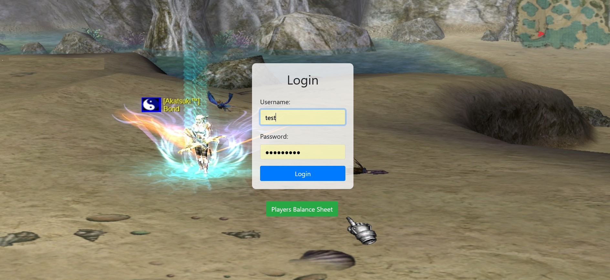
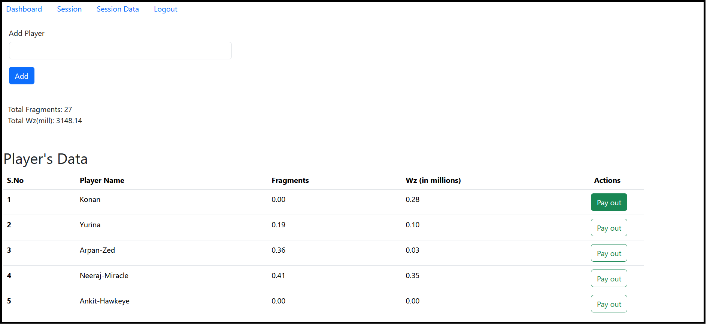
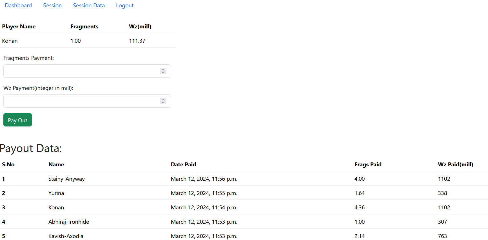
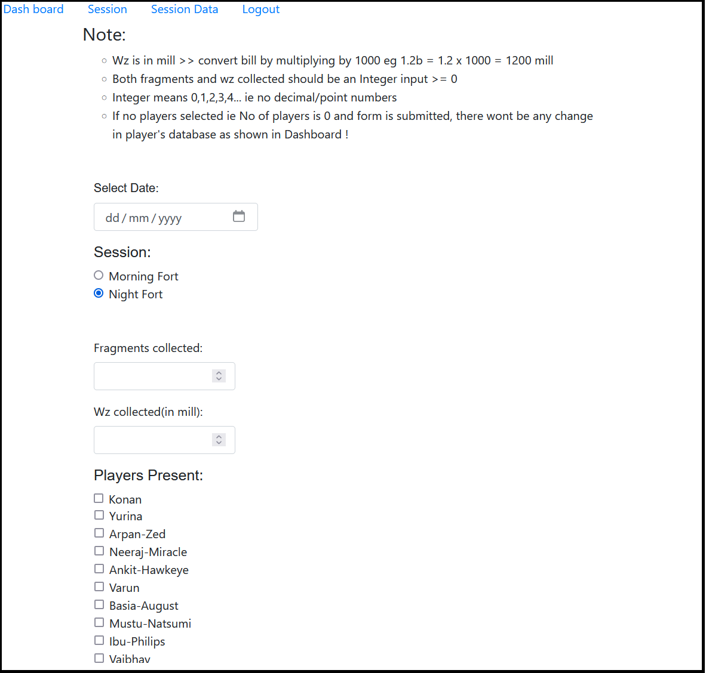

# A3 Resource Management

<br>

A3 Resource Management, a dynamic web application designed to streamline resource tracking and sharing within the popular online MMORPG A3. This project caters to the A3 gaming community, aiming to enhance their experience through efficient resource management. 

<hr>

- **Home page**:



- **Dashboard**:



- **Payout**:



- **Session data**:



<hr>

## `Tech stack`

- Django
- sqlite
- Javascript
- Bootstrap

## `Installing`
```bash
# downloading the project
gh repo clone niraj2099M/A3-Resource-Management
```
### After that, you need to open the project in your IDE and run it.
        cd qms


- ## Command to perform migrations
        python3 manage.py makemigrations
        python3 manage.py migrate

- ## Command to run server
        python3 manage.py runserver


- ## Login credentials
        Username: test
        Password: niraj1726


